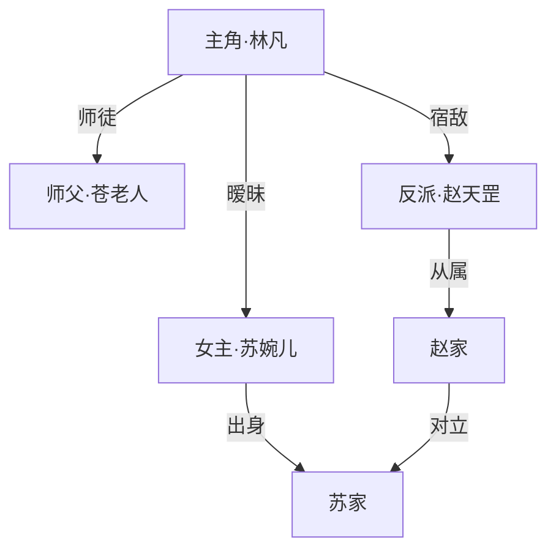
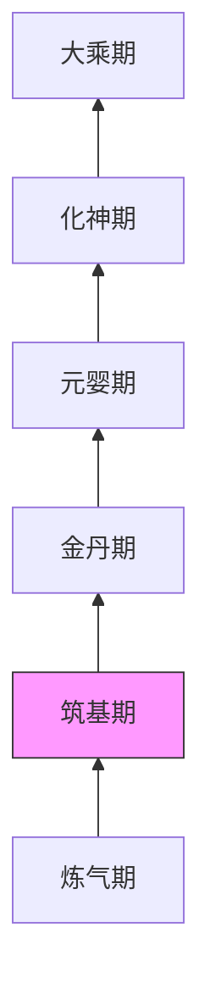

# 爽文小说生成器

根据用户提供的内容方向，自动完善提示词并生成章节制爽文小说。通过 `.learnings/` 记忆系统维护故事连续性，确保角色、地点、情节前后一致。下文 `output/`、`.learnings/` 均相对**工作区根**（见下节）。

## 产物目录（工作区根）

- **固定根路径**：`/root/userdata/workspace/novel-generator/`（与 skill 名 `novel-generator` 一致）。所有**新建或更新**的章节、提示词、大纲、图解、记忆文件、失败记录等产物，**必须**写在该目录之下；**不**依赖技能仓库在磁盘上的位置或当前 `cwd`。
- **子目录约定**：后文写的 `output/` 指 `.../novel-generator/output/`，`.learnings/` 指 `.../novel-generator/.learnings/`，可继续沿用你习惯的子结构（在根下自创建即可）。
- **文件命名**：**无强制要求**；以创作与检索需要为准。后文「文件命名（建议）」仅作**可选**规范。

## 交付（`MEDIA:`）

`生成成功` 与 `MEDIA:` **只用于「章节正文」在磁盘上的落点**，即本回合在 **`.../output/`** 下**按章**新建或已更新的**章节文件**；**不**为 `.learnings/`、提示词、大纲、图解等列 `MEDIA:`（这些照常写入工作区即可，但不出现在该交付块里）。

规则：

1. 第一行写 **`生成成功`**
2. 本回合**每产出一章**（或更新一章正文），**单独一行** **`MEDIA:` + 该章文件的绝对路径**（`MEDIA:` 与路径之间**无空格**；路径在 `output/` 下，以 `/` 起首）。
3. 若本回合只写记忆、提示词、未写章节，则**不要**输出 `生成成功` / `MEDIA:` 块，除非同时产出了可交付的章节文件。

**示例**（本回合生成两章，则两行 `MEDIA:`）：

```
生成成功
MEDIA:/root/userdata/workspace/novel-generator/output/第01章_开篇.md
MEDIA:/root/userdata/workspace/novel-generator/output/第02章_暗流.md
```

## AI 内容标识（合规）

千问合规：本 skill **生成或更新**的 `.md` / `.txt` 产物文件，须在**文件最末尾**增加显式标识（非搜索、非格式转换、非整理用户已有文件）。

**本 skill 必须打标：** 本回合在 `/root/userdata/workspace/novel-generator/` 下新建或更新的所有 AI 生成 `.md` / `.txt` 产物，包括但不限于 `output/` 下的提示词、大纲、章节正文、人物关系图/势力分布图/等级体系图等图解文件，以及 `.learnings/` 下的 `CHARACTERS.md`、`LOCATIONS.md`、`PLOT_POINTS.md`、`STORY_BIBLE.md`、`ERRORS.md` 等记忆文件。

**本 skill 不打标：** 非本 skill 生成/更新的用户原始文件；`.json`、图片等非 `.md` / `.txt` 文件不得通过追加尾注破坏格式，需走对应格式的打标方案。

**尾注格式（固定）：** 正文结束后空一行 → `---` → 空一行 → 单独一行：`内容由 AI 生成`（勿插在正文中间）。勿实现 PDF/Office 隐式元数据。

**顺序：** 每个产物文件最终 `write` → 分别检查文末尾注 → 再输出 `生成成功` / `MEDIA:`（如有章节交付）。是否出现在 `MEDIA:` 中不影响打标要求；多文件产出时，每个符合条件的文件都要分别追加。修订后重新检查；已有相同尾注勿重复追加。

## 快速参考

| 场景                  | 操作                                              |
| --------------------- | ------------------------------------------------- |
| 用户提供小说方向/题材 | 执行「提示词生成流程」，产出完善的创作提示词      |
| 开始创作新章节        | 先读取 `.learnings/` 中的记忆文件，再按模板生成 |
| 引入新角色            | 记录到 `.learnings/CHARACTERS.md`               |
| 出现新地点            | 记录到 `.learnings/LOCATIONS.md`                |
| 关键情节转折          | 记录到 `.learnings/PLOT_POINTS.md`，生成图解    |
| 生成失败/质量不佳     | 记录到 `.learnings/ERRORS.md`，分析原因         |
| 输出章节              | 在 `output/` 中**按章**生成/更新；交付时**仅**对本回合的章节各一行 `MEDIA:`（`生成成功` 块里只出现章节，不出现 `.learnings` 等） |

---

## 工作流总览

（产物均落在工作区根 `/root/userdata/workspace/novel-generator/` 下。）

```
用户提供方向（题材/关键词/灵感）
        ↓
  ┌─────────────────┐
  │ 1. 提示词生成    │ → 自动补全世界观、人设、冲突、节奏
  └────────┬────────┘
           ↓
  ┌─────────────────┐
  │ 2. 大纲规划      │ → 全局章节大纲 + 起承转合设计
  └────────┬────────┘
           ↓
  ┌─────────────────┐     ┌─────────────────┐
  │ 3. 逐章生成      │ ←→  │ .learnings/ 记忆 │
  └────────┬────────┘     └─────────────────┘
           ↓
  ┌─────────────────┐
  │ 4. 输出 & 图解   │ → <工作区根>/output/第XX章.md + 关键情节图解
  └─────────────────┘
```

---

## 第一步：提示词生成与完善

用户只需提供一个方向，代理自动补全为完整的创作提示词。

### 用户输入示例

用户可能只给出一句话：

- "写一个都市修仙的爽文"
- "重生回高中逆袭成商业大亨"
- "废柴少年获得系统后一路碾压"

### 提示词自动完善流程

收到用户方向后，按以下维度自动补全：

```
1. 题材定位    → 主类型 + 子类型（如：都市 + 修仙）
2. 世界观设定  → 力量体系、社会规则、时代背景
3. 主角人设    → 初始身份、性格、金手指/挂
4. 核心冲突    → 主线矛盾 + 前3章的即时冲突
5. 爽点设计    → 打脸节奏、升级频率、装逼方式
6. 节奏规划    → 每N章一个小高潮、每M章一个大高潮
7. 配角框架    → 对手/盟友/红颜各至少1人
8. 开篇钩子    → 第一章用什么抓住读者
```

完善后的提示词保存到工作区根下 `output/提示词.md`，并请用户确认或调整。

### 提示词质量检查

完善后自检以下项：

- [ ] 主角有明确的"逆袭起点"（够惨才够爽）
- [ ] 金手指/系统有清晰的规则和限制
- [ ] 前三章至少有一个"打脸"场景设计
- [ ] 力量体系有明确层级（便于体现碾压感）
- [ ] 有至少一个"众人皆看不起 → 被打脸"的经典结构

---

## 第二步：大纲规划

在提示词确认后、正式写作前，先生成全局大纲。

### 大纲结构

```markdown
# 《小说名》大纲

## 基本信息
- 题材：
- 预计章节数：
- 每章字数：约2000-3000字

## 力量/等级体系
（从低到高列出等级）

## 主线剧情走向
### 第一卷：[卷名]（第1-N章）
- 核心冲突：
- 主角成长：从XX到XX
- 爽点设计：

### 第二卷：[卷名]（第N+1-M章）
...

## 关键转折点
1. 第X章：（描述转折）
2. 第X章：（描述转折）
```

大纲保存到工作区根下 `output/大纲.md`。

---

## 第三步：逐章生成

### 生成前必读

每次生成新章节前，**必须**读取以下记忆文件：

```
.learnings/CHARACTERS.md    → 当前所有角色的状态
.learnings/LOCATIONS.md     → 已出现的地点
.learnings/PLOT_POINTS.md   → 已发生的关键情节
.learnings/STORY_BIBLE.md   → 世界观设定和规则
```

### 章节生成模板

每章按以下结构生成：

```markdown
# 第XX章 [章节名]

> **本章概要**：一句话概括本章核心事件
> **本章爽点**：本章的主要爽感来源
> **情绪曲线**：低开高走 / 层层递进 / 反转爆发

---

（正文内容，2000-3000字）

---

> **章末钩子**：留下的悬念，引导读者继续
```

### 章节质量标准

| 要素   | 要求                                       |
| ------ | ------------------------------------------ |
| 节奏   | 每章至少一个小爽点，不能平淡流水           |
| 冲突   | 每章有明确的矛盾推动情节                   |
| 悬念   | 章末必须设置钩子，让人想看下一章           |
| 连贯性 | 与前文角色状态、地点描写、已有情节保持一致 |
| 递进感 | 主角能力/地位/见识要有可感知的成长         |
| 对话   | 对话要有个性差异，反派不能太蠢             |

### 爽文节奏公式

```
每 1-2 章：小打脸（碾压小角色、获得小收获）
每 3-5 章：中打脸（击败阶段性对手、突破等级）
每 8-12 章：大高潮（翻转局势、揭示真相、大规模碾压）
每 15-20 章：卷终决战（解决卷级矛盾、主角阶段性质变）
```

---

## 第四步：记忆管理

### 写入时机

| 事件                             | 记录到             | 何时写入               |
| -------------------------------- | ------------------ | ---------------------- |
| 新角色出场                       | `CHARACTERS.md`  | 该章生成完毕后立即写入 |
| 角色状态变化（升级、受伤、死亡） | `CHARACTERS.md`  | 更新对应角色条目       |
| 新地点出现                       | `LOCATIONS.md`   | 该章生成完毕后立即写入 |
| 关键情节发生                     | `PLOT_POINTS.md` | 该章生成完毕后立即写入 |
| 世界观规则补充                   | `STORY_BIBLE.md` | 发现新设定时立即写入   |
| 生成失败或质量差                 | `ERRORS.md`      | 失败后立即记录原因     |

### 读取时机

**每次生成新章节前**必须读取所有记忆文件，确保：

- 不会让已死角色复活
- 不会把"东城"写成"西城"
- 不会忘记上一章埋的伏笔
- 不会重复已有的情节桥段

---

## 第五步：关键情节图解

当出现以下场景时，生成对应的图解：

| 场景       | 图解内容                     |
| ---------- | ---------------------------- |
| 关键战斗   | 双方站位、力量对比、胜负关键 |
| 势力地图   | 各方势力的关系与分布         |
| 等级突破   | 角色成长路线图               |
| 人物关系   | 主要角色关系网               |
| 重大剧情线 | 剧情时间线/因果链            |

图解使用 Mermaid 语法嵌入 md 文件，或使用图像生成工具生成。

### 图解示例（Mermaid）

**人物关系图：**



**等级体系图：**



---

## 第六步：失败记录

生成失败或质量不达标时，记录到 `.learnings/ERRORS.md`。

### 常见失败场景

| 失败类型 | 描述                 | 记录内容                   |
| -------- | -------------------- | -------------------------- |
| 角色穿帮 | 已死角色再次出现     | 穿帮章节、角色名、正确状态 |
| 设定矛盾 | 力量体系自相矛盾     | 矛盾点、涉及章节、修正方案 |
| 节奏失控 | 连续多章无爽点       | 失控起始章节、节奏分析     |
| 情节重复 | 相似桥段反复出现     | 重复内容、首次出现位置     |
| 人设崩塌 | 角色行为违背人设     | 角色名、崩塌行为、原始人设 |
| 生成中断 | 技术原因导致生成失败 | 错误信息、中断位置         |

### 失败记录格式

```markdown
## [NOVEL-ERR-YYYYMMDD-XXX] 失败类型

**记录时间**: ISO-8601
**章节**: 第XX章
**严重程度**: low | medium | high | critical

### 问题描述
具体发生了什么

### 影响范围
影响了哪些章节、角色、情节线

### 修正方案
如何修复，是否需要重写

### 预防措施
如何避免同类问题再次发生
```

---

## 输出规范

`生成成功` / `MEDIA:` 的用法见上节 **「交付（MEDIA:）」**（**仅**章节、**按章**一行）；其他产物路径仍为工作区根下的**绝对路径**。

### 文件结构

（以下树状结构位于工作区根 `/root/userdata/workspace/novel-generator/` 之下。）

```
output/
├── 提示词.md           # 完善后的创作提示词
├── 大纲.md             # 全局章节大纲
├── 第01章_[章名].md    # 各章节独立文件
├── 第02章_[章名].md
├── 第03章_[章名].md
├── ...
├── 人物关系图.md        # 关键图解
├── 势力分布图.md
└── 等级体系图.md
```

### 文件命名规范

- 章节文件：`第XX章_章节名.md`（XX 用两位数字，如 01、02）
- 图解文件：`[图解类型].md`
- 如果超过 99 章，使用三位数字：`第XXX章_章节名.md`

---

## 创作原则

### 爽文核心要素

1. **强代入感** — 读者能轻松代入主角视角
2. **快节奏** — 不拖泥带水，每章有进展
3. **层层递进** — 敌人越来越强，主角越来越猛
4. **装逼打脸** — 被小看 → 展示实力 → 众人震惊，循环往复
5. **金手指合理** — 有挂但有规则，不是无限制开挂
6. **伏笔呼应** — 前文埋下的线索后文要收回来

### 禁忌事项

- 不要连续两章以上没有爽点
- 不要让反派太愚蠢（衬托不出主角的强）
- 不要忘记已有角色（出场后人间蒸发）
- 不要突然修改已确立的设定
- 不要让主角无缘无故变弱（除非有合理剧情需要）

---

## 初始化新小说

在**要求固定绝对路径**的运行环境（如云工作区挂载）中，由执行方在 **`/root/userdata/workspace/novel-generator/`** 下自行创建 `output/`、`.learnings/` 等目录即可，**不依赖**必须跑通本仓库自带脚本。

仓库内亦提供初始化脚本（面向**本地克隆本技能仓库**的场景，当前实现将目录建在**技能目录旁**的 `output/`、`.learnings/`，与上文工作区根可能不一致；以本 SKILL 的工作区根为准）：

```bash
./scripts/init-novel.sh 小说名称
```

若运行该脚本，通常会创建技能目录下的：

- `output/` 目录
- 清空 `.learnings/` 中的旧记录（保留模板头部）
- 提示你输入小说方向

详见 `scripts/init-novel.sh`。

---

## 与 self-improving-agent 的协作

本技能的 `.learnings/` 系统参考了 `self-improving-agent` 的设计理念：

| self-improving-agent | novel-generator       |
| -------------------- | --------------------- |
| 记录代码错误         | 记录剧情穿帮          |
| 记录知识空白         | 记录设定矛盾          |
| 提升到 CLAUDE.md     | 沉淀到 STORY_BIBLE.md |
| 提取为技能           | 提炼为创作模式        |

核心思想一致：**捕获 → 记录 → 沉淀 → 复用**。
