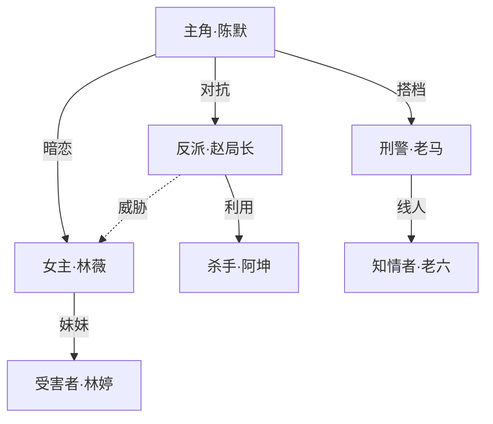

# 剧本创作生成器

根据用户提供的内容方向，自动完善提示词并生成专业剧本。通过 `.learnings/` 记忆系统维护剧本连续性，确保角色、场景、剧情线前后一致。

## 快速参考

| 场景                  | 操作                                                                 |
| --------------------- | -------------------------------------------------------------------- |
| 用户提供剧本方向/题材 | 执行「提示词生成流程」，产出完善的创作提示词                         |
| 开始创作新场次        | 先读取 `.learnings/` 中的记忆文件，再按模板生成                      |
| 引入新角色            | 记录到 `.learnings/CHARACTERS.md`                                    |
| 出现新场景            | 记录到 `.learnings/SCENES.md`                                        |
| 关键剧情转折          | 记录到 `.learnings/PLOT_POINTS.md`，生成图解                         |
| 生成失败/质量不佳     | 记录到 `.learnings/ERRORS.md`，分析原因                              |
| 输出场次              | 按场次生成独立 md 文件到 `/root/userdata/workspace/[剧本标题]/` 目录 |

---

## 工作流总览

```
用户提供方向（题材/关键词/灵感）
        |
  +---------------------+
  | 1. 提示词生成        | -> 自动补全世界观、人设、冲突、戏剧结构
  +----------+----------+
             |
  +---------------------+
  | 2. 大纲规划          | -> 全局剧本大纲 + 三幕/多幕结构设计
  +----------+----------+
             |
  +---------------------+     +---------------------+
  | 3. 逐场生成          | <-> | .learnings/ 记忆     |
  +----------+----------+     +---------------------+
             |
  +---------------------+
  | 4. 输出 & 图解       | ->
  +---------------------+
```

> **⚠️ 输出目录（强制规则）**：所有交付文件（提示词、大纲、场次等）**必须**保存到 `/root/userdata/workspace/[剧本标题]/` 目录下，先 `mkdir -p` 创建该目录再写入。完成后**必须**以 `MEDIA:` + 文件绝对路径的格式逐行输出所有生成的文件，不得遗漏。

---

## AI 内容标识（合规）

千问合规：本 skill **生成或更新**的 `.md` / `.txt` 产物文件，须在**文件最末尾**增加显式标识（非搜索、非格式转换、非整理用户已有文件）。

**本 skill 必须打标：** 本回合在 `/root/userdata/workspace/[剧本标题]/` 下新建或更新的所有 AI 生成 `.md` / `.txt` 产物，包括但不限于提示词、大纲、角色表、各场次正文、人物关系图/戏剧结构图/时间线图等图解文件，以及 `.learnings/` 下的 `CHARACTERS.md`、`SCENES.md`、`PLOT_POINTS.md`、`STORY_BIBLE.md`、`ERRORS.md` 等记忆文件。

**本 skill 不打标：** 非本 skill 生成/更新的用户原始文件；`.json`、图片等非 `.md` / `.txt` 文件不得通过追加尾注破坏格式，需走对应格式的打标方案。

**尾注格式（固定）：** 正文结束后空一行 → `---` → 空一行 → 单独一行：`内容由 AI 生成`（勿插在正文中间）。勿实现 PDF/Office 隐式元数据。

**顺序：** 每个产物文件最终 `write` → 分别检查文末尾注 → 再输出 `MEDIA:` 交付。是否出现在 `MEDIA:` 中不影响打标要求；多文件产出时，每个符合条件的文件都要分别追加。修订后重新检查；已有相同尾注勿重复追加。

---

## 第一步：提示词生成与完善

### 澄清规则（红线）

**默认直接开干**。只有当**剧本格式**或**题材方向**缺失时，才向用户澄清。

**关键参数**（缺失即触发澄清，**不可默认**）：

- **剧本格式**：电影 / 电视剧 / 话剧 / 短剧 / 微电影 ——节奏、体量、场次结构、表演风格差异极大，必须由用户决定
- **题材方向**：悬疑 / 爱情 / 科幻 / 古装 / 武侠 / 历史 / 都市 等——决定故事内核

| 情况                                    | 处理                                |
| --------------------------------------- | ----------------------------------- |
| 剧本格式 + 题材方向 都给出              | **不澄清**，直接走自动补全流程      |
| 只缺其中一项                            | **澄清一次**：仅问缺失的那项        |
| 剧本格式 + 题材方向 都缺失              | **澄清一次**：合并问"类型和方向"    |
| 用户没说世界观/人设/结构/冲突等内部维度 | **不澄清**，按下面 8 维内部脑补     |

**澄清原则**：

- 一次问完，**禁止追问**（用户给出关键参数后，剩下世界观/人设/结构等全部走自动补全，不再追问）
- **禁止举例式提问**（不要列"本格派/社会派/硬汉派？"让用户挑，应使用引导式提问）
- **禁止"配置预览先行"**（不要先生成完整提示词文件再让用户确认）
- **禁止针对其他维度（世界观/人设/结构/冲突/场景/角色关系/开场钩子）澄清**
- **澄清输出契约（端上协议）**：当且仅当本轮要向用户澄清时，输出末尾必须**紧贴问题文本**追加 `[CLARIFY]` 标记——**同一行、无空格、无换行**，例如 `想写什么类型的剧本？[CLARIFY]`。**未触发澄清时绝对不能出现** `[CLARIFY]` ——端上据此判断当前是否处于澄清态。标记字符固定写作 `[CLARIFY]`，禁止任何变体（如 `[Clarify]` / `<CLARIFY>` / `CLARIFY:`）

**话术参考**（含端上协议格式）：

只缺格式：

```
想写什么类型的剧本？[CLARIFY]
```

只缺题材：

```
想写什么方向的剧本？[CLARIFY]
```

格式 + 题材都缺：

```
想写什么类型和方向的剧本？[CLARIFY]
```

未触发澄清时（两项都给了）直接进入内部脑补 + 大纲，输出中**不得包含** `[CLARIFY]`。

### 用户输入示例

用户可能只给出一句话：

- "写一个悬疑推理的电影剧本"
- "都市爱情短剧，甜宠风格"
- "科幻末日题材，人类最后的希望"
- "古装宫斗话剧"

### 提示词内部脑补维度（仅作为创作脚手架，不要求用户确认）

收到用户方向（或澄清后的方向）后，按以下维度内部补全：

```
1. 类型定位    -> 剧本类型（电影/电视剧/话剧/短剧/微电影）+ 题材类型
2. 世界观设定  -> 时空背景、社会规则、核心设定
3. 戏剧结构    -> 三幕式/序列式/多线叙事/环形结构
4. 主角人设    -> 身份、性格弧光、内在需求 vs 外在目标
5. 核心冲突    -> 主线冲突 + 人物内心冲突 + 关系冲突
6. 场景规划    -> 关键场景设定、视觉风格、空间特征
7. 角色关系网  -> 主角/对手/盟友/爱人/导师各至少1人
8. 开场钩子    -> 第一场戏用什么抓住观众
```

脑补后的提示词保存到 `/root/userdata/workspace/[剧本标题]/提示词.md` 作为后续生成的内部参考，**不再单独要求用户确认**——直接进入下一步。

### 提示词质量检查

完善后自检以下项：

- [ ] 主角有明确的"内在需求"和"外在目标"之间的矛盾
- [ ] 戏剧结构有清晰的三幕转折点（激励事件、中点逆转、高潮危机）
- [ ] 对手角色有独立动机，不是单纯的"坏人"
- [ ] 前三场至少有一个强烈的戏剧冲突
- [ ] 有至少一个"所有人都以为A，结果是B"的反转设计
- [ ] 台词有角色辨识度，不同角色说话方式有差异

---

## 第一步半：知识搜索判断

提示词生成后，判断是否需要搜索外部知识来支撑创作。

### 判断标准

| 情况                                            | 策略                         |
| ----------------------------------------------- | ---------------------------- |
| 纯虚构/架空世界观，无需真实背景                 | 跳过搜索，直接进入大纲       |
| 涉及历史背景、真实事件、专业领域（医疗/法律等） | 使用 fast_search 搜索 1-2 次 |
| 用户已提供充足参考材料                          | 跳过搜索，直接使用           |

### 搜索方式

如需搜索，使用 `ra_search` 工具：

调用 `ra_search` 工具，参数：

- `query`: `"<与剧本背景相关的搜索关键词>"`

- 最多搜索 2 次，聚焦剧本所需的关键背景知识
- 搜索结果记录到 `.learnings/STORY_BIBLE.md` 中作为世界观参考

---

## 第二步：大纲规划

在提示词生成后、正式写作前，先生成全局大纲。

### 大纲输出格式

大纲必须包含以下四个部分：

#### 1. `<title>` 剧本标题

#### 2. `<WORK_OVERVIEW>` 作品全局概述（1000-1500字）

完整描述整部作品的全貌，包括：

- 类型定位（电影/电视剧/话剧/短剧/微电影）+ 题材
- 预计时长/集数/场次
- 基调（紧张/温暖/黑色幽默/史诗感...）
- 核心故事线概述（完整的故事弧，从开头到结尾）
- 主要角色及其关系、弧光
- 三幕结构的关键转折点（激励事件、中点逆转、一切尽失、高潮）
- 视觉风格（色调、标志性视觉元素、音乐/声音方向）

> **此概述将作为全局上下文传递给每一场的写作**，确保所有场次对全局故事保持一致理解。

#### 3. `<STRUCTURE>` 分场结构

按 section 组织，**每个 section 对应一场戏**（尽量保证一个 section = 一场），格式如下：

```markdown
<section>
## 第XX场 [场景名]
- 场景类型：内景/外景 + 日/夜
- 地点：
- 出场角色：
- 本场戏剧目标：（50-100字详细说明）
- 情绪基调：
- 预计字数：XXXX字

**在全局结构中的位置**：第X幕，承接第XX场的[事件]，为第XX场的[事件]铺垫

</section>

<section>
## 第XX场 [场景名]
...
</section>
```

**分场原则**：

- 宁可多拆 section，不要合并多场到一个 section
- 每个 section 的预计字数应相对均匀
- 电影：约 90-120 个 section（场）
- 电视剧每集：约 20-30 个 section（场）
- 短剧/微电影：约 5-15 个 section（场）

#### 4. `<WRITING_STYLE>` 写作风格指南

根据剧本类型和题材，生成详细的写作风格约束，包括：

- 整体文风（写实/诗意/硬朗/细腻...）
- 台词风格（口语化程度、文学性、时代特征）
- 场景描写风格（简洁/细腻/电影感/舞台感）
- 节奏把控要求（快节奏/慢热/交替...）
- 特殊风格要求（方言、时代用语、专业术语等）

> **此风格指南将作为全局约束传递给每一场的写作**，确保全篇风格统一。

大纲保存到 `/root/userdata/workspace/[剧本标题]/大纲.md`。

---

## 第三步：逐场生成

### 生成前必读

每次生成新 section 前，**必须**读取以下内容：

**全局上下文（每次必传）**：

```
大纲中的 <WORK_OVERVIEW>    -> 作品全局概述，确保对整体故事的理解
大纲中的 <WRITING_STYLE>    -> 写作风格指南，确保全篇风格统一
```

**记忆文件**：

```
.learnings/CHARACTERS.md    -> 当前所有角色的状态和弧光进展
.learnings/SCENES.md        -> 已出现的场景设定
.learnings/PLOT_POINTS.md   -> 已发生的关键剧情点
.learnings/STORY_BIBLE.md   -> 世界观设定和规则
```

### 按 section 逐场生成

按大纲 `<STRUCTURE>` 中的 section 顺序逐个生成，**每次只写一个 section（即一场戏）**。

> **⚠️ 硬性规则：每个 section 必须完整写完，严禁写到一半停止。** 如果一个 section 已经开始写，就必须写到该 section 结束（包括完整的场景描写、全部对白、本场悬念和下场预示），然后再保存文件。不完整的 section 等于废稿。

**分批交付规则（必须严格执行）**：

1. 每批最多写 **5 场**
2. **每写完一场，立即将该场文件保存到 `/root/userdata/workspace/[剧本标题]/` 目录**
3. 一批写完后（达到 5 场或全部写完），**必须立即执行交付步骤（输出 MEDIA: 路径），不得跳过**
4. 上传完成后输出进度汇报，例如：「已完成第 1-5 场（共约 85 场），下一批将写第 6-10 场。回复"继续"即可开始下一批。」
5. 用户回复「继续」后，自动接着写下一批
6. 如果剩余场次不足 5 场，则一次性写完并上传
7. **如果因为输出长度限制无法写满 5 场，写完当前场后必须立即停下来执行交付（输出 MEDIA: 路径），把已完成的场次全部交付，然后汇报进度等待用户说"继续"。严禁写到一半既不凑够 5 场也不交付就结束回复。**

> **⚠️ 核心原则：不管写了几场，只要停下来就必须上传已完成的所有文件。没有上传 = 没有交付 = 任务未完成。**

### 每批交付（必须执行）

每批场次写完后，**必须立即**以 `MEDIA:` 格式逐行输出本批所有生成文件的绝对路径：

```
MEDIA:/root/userdata/workspace/[剧本标题]/大纲.md
MEDIA:/root/userdata/workspace/[剧本标题]/第01场_场景名.md
MEDIA:/root/userdata/workspace/[剧本标题]/第02场_场景名.md
...
```

- 第一批需要包含大纲文件
- **每个文件一行，格式为 `MEDIA:` + 文件绝对路径，不得遗漏本批任何已完成的文件**

**核心原则**：

- 每个 section 必须完整写完，不得中途截断或跳过
- 严格按照大纲中该 section 的戏剧目标和预计字数完成
- 写完一个 section 后更新记忆文件，再开始下一个 section

### 场次生成模板

每场按以下结构生成：

```markdown
# 第XX场 [场景名]

> **场景概要**：一句话概括本场核心事件
> **场景类型**：内景/外景 + 日/夜/晨/昏
> **地点**：具体场景地点
> **时间**：剧中时间
> **出场角色**：角色列表
> **本场戏剧目标**：本场要解决/推动的核心问题
> **情绪基调**：紧张/温馨/压抑/激烈/幽默...

---

（场景描写 + 角色动作 + 对白）

格式规范：

- 场景描写用普通段落，简洁有画面感
- 角色动作用括号标注，如：（转身，看向窗外）
- 对白格式：
  角色名
  台词内容。

  角色名（情绪/动作提示）
  台词内容。

---

> **本场悬念**：留下的悬念，引导观众继续
> **下场预示**：下一场的情绪/内容方向
```

### 场次质量标准

| 要素     | 要求                                       |
| -------- | ------------------------------------------ |
| 戏剧性   | 每场有明确的戏剧目标和障碍                 |
| 冲突     | 每场有可感知的冲突或张力                   |
| 台词     | 对白有潜台词，角色说话有辨识度             |
| 视觉感   | 场景描写要有画面感，能被"拍"出来           |
| 节奏     | 文戏武戏交替，紧松有度                     |
| 连贯性   | 与前文角色状态、情感发展、已有剧情保持一致 |
| 角色弧光 | 角色的变化是渐进的，每场都有微小的推动     |
| 进出场   | 每个角色进出场都有理由，不能凭空出现/消失  |

### 戏剧节奏公式

```
每 1-2 场：小冲突/小揭示（角色间的摩擦、新线索出现）
每 3-5 场：中型转折（关系破裂/联盟、真相部分揭露）
每 8-12 场：大高潮（命运逆转、核心秘密揭开、生死抉择）
幕间转折：结构性转折点（激励事件、中点逆转、一切尽失、高潮）
```

### 台词创作原则

1. **潜台词原则**：角色说的不等于角色想的，好的台词有表层和深层两层含义
2. **角色辨识度**：每个角色有独特的说话方式（用词习惯、句式长短、口头禅）
3. **动作驱动**：对白要推动剧情，不是闲聊；每句话背后都有角色的"想要"
4. **冰山理论**：台词只露出冰山一角，更大的情感和信息在水面下
5. **节奏感**：注意台词的长短交替、快慢变化、沉默的运用
6. **禁忌**：
   - 不要让角色直接说出自己的感受（"我很难过" -> 用行动/隐喻表达）
   - 不要用台词做旁白式的信息交代
   - 不要所有角色用同一种语气说话

---

## 第四步：记忆管理

### 写入时机

| 事件                                 | 记录到           | 何时写入               |
| ------------------------------------ | ---------------- | ---------------------- |
| 新角色出场                           | `CHARACTERS.md`  | 该场生成完毕后立即写入 |
| 角色状态变化（弧光推进、受伤、死亡） | `CHARACTERS.md`  | 更新对应角色条目       |
| 新场景出现                           | `SCENES.md`      | 该场生成完毕后立即写入 |
| 关键剧情发生                         | `PLOT_POINTS.md` | 该场生成完毕后立即写入 |
| 世界观规则补充                       | `STORY_BIBLE.md` | 发现新设定时立即写入   |
| 生成失败或质量差                     | `ERRORS.md`      | 失败后立即记录原因     |

### 读取时机

**每次生成新场次前**必须读取所有记忆文件，确保：

- 不会让已死角色复活
- 不会让角色性格突变（没有铺垫的情况下）
- 不会忘记已建立的角色关系和情感线
- 不会违背已确立的世界观设定
- 不会重复已有的戏剧情境

---

## 第五步：关键场景图解

当出现以下场景时，生成对应的图解：

| 场景        | 图解内容                     |
| ----------- | ---------------------------- |
| 人物关系    | 主要角色关系网和利益链       |
| 戏剧结构    | 三幕结构图和情绪曲线         |
| 场景动线    | 关键场景的空间布局和角色走位 |
| 时间线      | 多线叙事的时间线交叉图       |
| 势力/阵营图 | 各方势力关系与冲突脉络       |

图解使用 Mermaid 语法嵌入 md 文件。

### 图解示例（Mermaid）

**人物关系图：**



**三幕结构图：**


---

## 第六步：失败记录

生成失败或质量不达标时，记录到 `.learnings/ERRORS.md`。

### 常见失败场景

| 失败类型   | 描述                     | 记录内容                     |
| ---------- | ------------------------ | ---------------------------- |
| 角色穿帮   | 角色行为违背已建立的人设 | 穿帮场次、角色名、正确状态   |
| 逻辑硬伤   | 情节发展违反因果逻辑     | 逻辑漏洞、涉及场次、修正方案 |
| 节奏失控   | 连续多场无冲突无推进     | 失控起始场次、节奏分析       |
| 台词同质化 | 不同角色说话方式雷同     | 涉及角色、问题台词、改进方向 |
| 设定矛盾   | 世界观/规则自相矛盾      | 矛盾点、涉及场次、修正方案   |
| 弧光断裂   | 角色成长缺乏过渡         | 角色名、断裂场次、缺失的铺垫 |
| 生成中断   | 技术原因导致生成失败     | 错误信息、中断位置           |

### 失败记录格式

```markdown
## [SCRIPT-ERR-YYYYMMDD-XXX] 失败类型

**记录时间**: ISO-8601
**场次**: 第XX场
**严重程度**: low | medium | high | critical

### 问题描述

具体发生了什么

### 影响范围

影响了哪些场次、角色、剧情线

### 修正方案

如何修复，是否需要重写

### 预防措施

如何避免同类问题再次发生
```

---

## 输出规范

### 文件结构

```
/root/userdata/workspace/[剧本标题]/
+-- 提示词.md            # 完善后的创作提示词
+-- 大纲.md              # 全局剧本大纲
+-- 角色表.md            # 完整角色档案
+-- 第01场_[场景名].md   # 各场次独立文件
+-- 第02场_[场景名].md
+-- 第03场_[场景名].md
+-- ...
+-- 人物关系图.md         # 关键图解
+-- 戏剧结构图.md
+-- 时间线图.md
```

### 文件命名规范

- 场次文件：`第XX场_场景名.md`（XX 用两位数字，如 01、02）
- 电视剧按集分组：`S01E01_第XX场_场景名.md`
- 图解文件：`[图解类型].md`
- 如果超过 99 场，使用三位数字：`第XXX场_场景名.md`

---

## 创作原则

### 剧本核心要素

1. **戏剧冲突** -- 每一场都要有冲突，没有冲突就没有戏
2. **角色弧光** -- 主角从A状态到B状态的内在变化是故事的灵魂
3. **潜台词** -- 好的台词永远在说另外一件事
4. **视觉叙事** -- 能用画面讲的故事不要用台词讲（show don't tell）
5. **结构张力** -- 三幕结构的每个转折点都要制造意外和紧张
6. **因果逻辑** -- 每一场戏都是前面的"因"导致的"果"，也是后面的"因"

### 禁忌事项

- 不要让角色直接陈述主题（观众不需要被教育）
- 不要用巧合推动剧情（巧合可以制造困境，但不能解决困境）
- 不要写没有目的的场景（每场戏至少推动剧情或揭示角色）
- 不要让反派没有合理动机（好的反派认为自己是对的）
- 不要忽视角色弧光的渐进性（突变 = 不可信）
- 不要连续两场以上用同一种情绪基调（要有对比和变化）

### 各类型剧本特殊要求

#### 电影剧本

- 时长约90-120分钟，约90-120场
- 严格遵循三幕结构，转折点明确
- 视觉优先，场景描写要有电影感
- 台词精炼，不要话剧式长篇独白

#### 电视剧剧本

- 每集约45分钟，20-30场
- 每集有独立的小故事弧，同时推进全季主线
- 每集结尾必须有钩子（让观众想看下一集）
- 注意角色成长的长线铺排

#### 话剧剧本

- 场景转换有限，对话驱动剧情
- 台词可以更文学化，允许独白和旁白
- 注意舞台调度的可行性
- 对白节奏要适合现场演出

#### 短剧/微电影剧本

- 时长3-15分钟，高度凝练
- 快速建立冲突，直奔主题
- 一个核心情感点/反转点
- 结尾要有力量感

---

## 初始化新剧本

使用初始化脚本快速创建一部新剧本的工作区：

```bash
./scripts/init-screenplay.sh 剧本名称
```

这会创建：

- `/root/userdata/workspace/[剧本标题]/` 目录
- 清空 `.learnings/` 中的旧记录（保留模板头部）
- 提示你输入剧本方向

详见 `scripts/init-screenplay.sh`。

---
